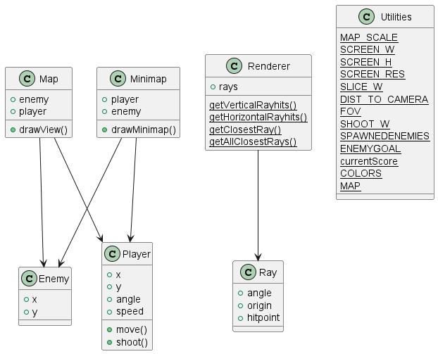

# Startdocument Eindopdracht Javascript

Startdocument van **Yannieck Blaauw**.
Student number **4976207**.

## Omschrijving
Dit is een spel geinspireerd door de orginele Wolvenstein 3D en DOOM. Het is een first person shooter.

## Instalatie
Voor het spelen van dit spel zal een lokale Python server nodig zijn.
Hiervoor zal minstens Python 3.10.8 geïnstalleerd moeten zijn. De python versie is te controleren met het commando: `py -V`

Er zal een python server moeten worden opgestart in de bestandsmap.
Open de commandprompt. Gebruik het commando `cd <bestandslocatie>` om naar deze map te gaan.
Zorg dat de bestandslocatie dezelfde plek is waar ook het bestand `index.html` staat.
Typ vervolgens het commando `py -m http.server`. Dit zal een server aanmaken.
Ga vervolgens in de browser naar `localhost:8000`. Het spel zal vanzelf opstarten.

## Spelregels
Het doel van het spel is om alle monsters binnen de tijd te verslaan. De tijd die hierover gedaan wordt is de score. De persoon met de laagste score zal bovenaan het scorebord staan.

## Controls
Gebruik `W` en `S` om vooruit en achteruit te bewegen. gebruik de muis om rond te kijken.
Klik op de linkermuisknop om te schieten

## Klassendiagram

## Demo video
